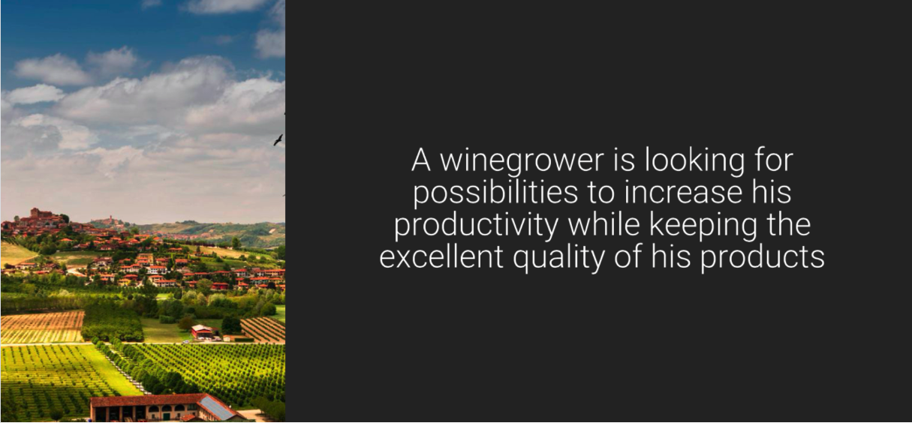
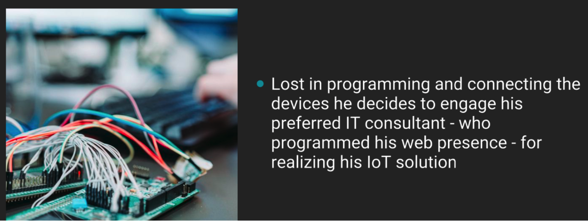
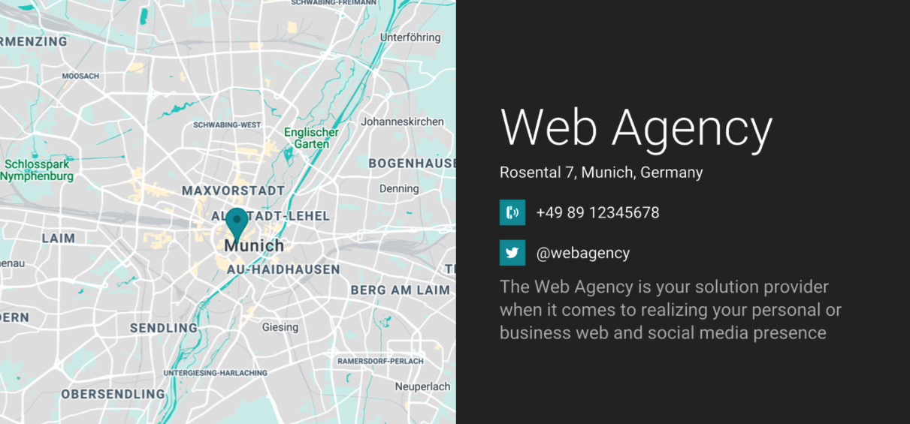
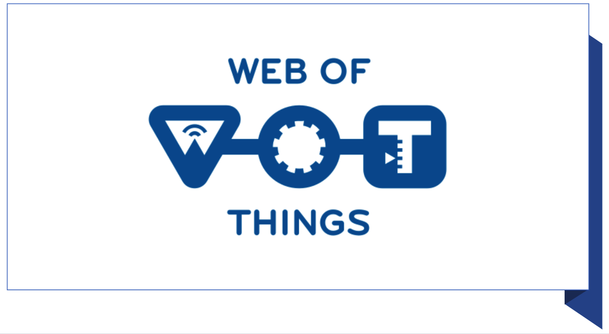

# Notes for Explainer Video Script

[Original slides](https://github.com/w3c/wot-marketing/blob/master/material/wot_explainer_script.pdf)

## Scene 1

* Spoken: 
   - A winegrower is looking for possibilities to increase (his) productivity while keeping the excellent quality of (his) products
       - Alt: A winemaker is looking for ways to increase productivity while keeping excellent product quality
* Staging: Far-away view of vineyard (maybe animation that zooms in from clouds...)
* Comments: 
   - Should gender-specific "his" be changed to gender-neutral "their" or perhaps to "her"?
     We could also use "the winegrower" etc, use plural "developers" (and "their" instead of "he"), etc.
     To highlight this issue I have put all gender-specific names and pronouns in parenthesis,
     and suggested some alternative text that avoids the issue.
   - Is "winegrower" standard usage in English?
     Or is "winemaker" better?
     Later slides use "winemaker" and I think it's better.
   - There are also multiple people (winegrower/winemaker, consultant/developer) - these could be different genders.
   - Later text also uses both "developer" and "consultant"; maybe we should pick one?
     This stakeholder name inconsistency issue applies to the entire text.
   - The original draft script had a female winegrower.  What happened?
   - There is also the issue of race.
     While it would be relatively easy to balance genders by having one male and one females since we have two stakeholders,
     race is not so easy since there are only two,
     and assigning specific races may have a polarizing effect instead.
     Also racial mixes are different in different parts of the world,
     so a combination that makes sense in the US may just be odd in Singapore, and vice-versa.
   - We could avoid the whole bias issue by using non-gender-and-race specific animal characters (eg cat and rabbits...).

## Scene 2a

* Spoken:
   - To constantly control the quality of (his) plants (he) is willing to install humidity and temperature sensors, and a sprinkler system.
       - Alt: To better control quality, the winemaker is willing to install humidity and temperature sensors, and a sprinkler system.
* Staging: 
   - Keep zooming in, stop on a closeup of some grapes on the vine
   - Show addition of sensors and sprinkler system
   
## Scene 2b
* Spoken:
   - In addition (he) wants to to receive weather forecasts from an online web service
       - Alt: Weather forecast data from an online web service would also be useful
* Staging: 
   - Show data coming from cloud
   - Since it's weather data, can be from an actual cloud...
   - Data can be 0's and 1's falling as rain...
   
Comment: 
   - Maybe "Weather" should be "Rain" to be more specific and match the visual?
   

## Scene 3

* Text: 
   - Lost in programming and connecting the devices (he) decides to engage (his) preferred IT consultant - who programmed (his) web presence - for realizing (his) IoT solution
       - Alt: Lost in programming and connecting devices, the winemaker decides to engage the IT consultant - who programmed the winemaker's web presence - to realize an IoT solution
* Staging: 
    - Show a "development system" that explodes in complexity
    - Winemaker has an idea (maybe a thought bubble) of asking the consultant that was used for the web presence for help with IoT
* Comments: 
   - Image in original shows a messy breadboard, but a more "professional" picture that relates to software (perhaps a circle-and-line graph that explodes in complexity) would be better.
   
## Scene 4

* Text:
   - Web Agency
   - Rosental 7, Munich, Germany
   - phone: +49 89 12345678
   - twitter: @webagency
   - The Web Agency is your solution provider when it comes to realizing your (personal or business) web and social media presence
* Staging: Show the result of an online search for a web solution provider
* Comments: 
   - Suggest deleting "personal and business", "personal" is weird, and phrase does not add value; put in paras above

## Scene 5

* Text:
    - (Joe), the lead developer at Web Agency likes the new challenge and is willing to broaden (his) IoT knowledge
         - Alt: The developers at Web Agency like the new challenge and are willing to broaden their IoT knowledge
    - (He) is an expert in Web technologies and does programming of both frontend as well as backend with Node JS
         - Alt: They like the new challenge and are willing to broaden their IoT knowledge
    - However, (he) only has a vague idea how to integrate hardware and fears the interoperability dilemma that he experienced in a former IoT project
         - Alt: However, they only have a vague idea how to integrate hardware and fear the interoperability dilemma that they experienced in a former IoT project
* Staging:
    - Show picture of a developer hacking away, scratching his/her/their head, shuddering a little at some bad memories of a past project (maybe a thought bubble showing the consultant vainly trying to plug together two incompatible connectors)
* Comment
    - "Joe" is another male... consider mixing it up a little, at least.
    - Also, we should avoid making all the characters white...
    - To avoid making "their" weird, could just have multiple developers (The lead developer -> The developers)
    
## Scene 6

* Text: 
    - Googling for a while for a better solution (he -> the consultant) finds information about the Web of Things (WoT)
    - WoT is a W3C activity that (promises -> enables) Web developers to become IoT developers using the tools and frameworks they love
    - WoT can be applied to different domains, (like -> such) as Industry or Building Automation
* Staging:
    - Google search, some results pop up (represented as icons and logos)
* Comments:
    - "Promises" is weird English.  "Allows" or "Enables" would be more natural
    - "like" is also more natural as "such"; changed above
    
## Scene 7

* Text:
    - ((Joe) starts off and -> The consultant) is happy to find a bunch of WoT tutorials on thingweb.io, YouTube, and GitHub
    - With node-wot, the various protocol bindings like HTTP, MQTT, and CoAP, and browser bundle (he -> the consultant) easily creates a full stack IoT solution that connects all the devices and features a great user interface
* Staging:
    - Show code rapidly being built, user interface popping up, etc.
* Comments:
    - Small fixes to original text included ("starts of" changed to "starts off", "connecting" to "that connects", etc).
    - We should provide some real code for the animator to use in a "build"
    - Should we also mention Node-RED?
    
## Scene 8

* Text:
    - Instead of creating a proprietary solution (he) leverages the WoT methodology to create IoT building blocks that extend his already existing Web technologies portfolio
    - Thing Descriptions, application templates, and semantics are now same class portfolio members as HTML pages, Javascript snippets, or CSS from his former projects
* Staging: 
    - Show a structure being built from a collection of blocks
    
## Scene 9

* Text:
    - As the main element of the WoT methodology the Thing Description (TD) is comparable to an index.html for Things
    - WoT TDs addresses several questions... 
* Staging: 
    - Show a thing (perhaps a sprinkler or sensor from the opening)
    - Show a "tag" attached to it (perhaps with a WoT TD logo, which we should provide)
    - Open tag, zoom in, see JSON of TD (which we should provide...)
* Comment: existing picture not that great, final step of zoom

## Scene 10

* Text: (various questions in circular array around TD logo; do not need to be spoken)
    Spoken: Various questions can be answered by the information in the TD
    Questions (written only):
    - What kind of data do you serve?
    - Who are you?
    - How does the payload structure look like?
    - How can I access the data or function?
    - What kinds of products and serializations do you support?
    - Is there context I need to understand (units, kinds of sensors, etc)
    - What kinds of functions to you have?
    - Are there some security constraints?
    - Do you have relationships to other Things?
* Staging: 
    - Developer has a thought bubble, zoom into it to set stage...
    - Questions should show up one by one, get "checked off"
* Comments: 
    - to save time, suggest not reading out the questions individually
    - The "context" question is a little vague, I suggest replacing it with a couple more concrete questions: what units do you use, are you an instance of a class of devices, et.
    - small English fixes
    
## Scene 11

* Text:
    - Not fiddling around for months, (Joe) creates the IoT solution in just a few sprints combining WoT TD, WoT protocol bindings, WoT scripting, and his web expertise
         - Alt: Instead of filling around for months, the developers create the IoT solution in just a few sprints by combining WoT TDs, WoT protocol bindings, and WoT scripting with their web expertise
    - (He) gains confidence in IoT and from now on considers (him)self as an expert in both IT and IoT 
         - Alt: The developers gain confidence in IoT and from now on consider themselves experts in both Web and IoT technologies
* Staging:
    - Imaging showing high-speed development, maybe playing off "sprint" (eg show developers running down a track)
* Comments:
    - Alternatives given have both gender-neutral language (using plurals) and fix some English issues
    
## Scene 12

* Text:
    - spoken: Now Joe is ready to tackle his next IoT challenge
        - Alt: Now the developers are ready to tackle their next IoT challenge
    - written: Extend a hotel's building automation system with home automation components and give the house technician a nice user interface for operating it
    - spoken: And yes, Web of Things is THE methodology (he)'ll choose
        - Alt: And yes, Web of Things is THE methodology they'll choose
* Staging:
    - Show job board
    - Zoom in on a job posting with the above written text, picture of a hotel
    - Zoom to WoT logo when talk about methodology
    
## Scene 13

* Staging:
    - zoom into WoT logo, hold

   
